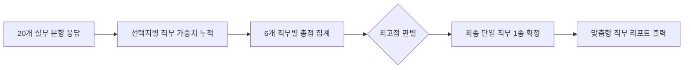

# 🚢 Trade MBTI | 무역 직무 적합도 진단 웹 애플리케이션

<p align="left">
  
  
  
  
</p>

> 실무 중심의 20가지 시나리오 문항을 통해 6대 무역 직무 중 자신에게 가장 적합한 단 하나의 직무를 도출하는 인터랙티브 웹 앱입니다.

---

## 📌 프로젝트 개요

무역·물류 전공자 및 구직자들이 자신의 문제 해결 성향과 업무 스타일에 맞는 최적의 커리어 패스를 탐색할 수 있도록 돕습니다. Streamlit 기반으로 제작되어 모바일과 웹에서 간편하게 테스트를 진행하고 결과를 확인할 수 있습니다.

* **진단 문항**: 실무 시나리오 기반 20문항 (단일 선택형)
* **결과 매핑**: 6개 핵심 무역 직무 중 최고 득점 1종 도출
* **기술 스택**: Python, Streamlit, Pandas, Plotly

---

## 🧭 진단 대상 6대 직무

| 직무명 | 주요 역할 및 미션 | 핵심 역량 키워드 |
| :--- | :--- | :--- |
| **해외영업** *(Overseas Sales)* | 신규 바이어 발굴, 글로벌 판로 개척, 수출 단가 및 계약 조건 협상 | `#네고` `#도전정신` `#바이어소통` |
| **무역영업관리/사무** *(Trade Operations)* | 인코텀즈 기반 계약 이행, L/C·B/L 등 선적 서류 통제 및 납기 관리 | `#정밀성` `#문서통제` `#프로세스` |
| **국제물류/포워딩** *(Forwarding & Logistics)* | 해상/항공 운임 네고, 스케줄링, 운송 경로 최적화 및 돌발 이슈 대응 | `#현장감` `#위기대응` `#기동력` |
| **글로벌 소싱/구매** *(Global Sourcing)* | 해외 제조사 발굴, 원가 구조 분석, 공급망 다변화 및 단가 최적화 | `#단가분석` `#전략소싱` `#SCM` |
| **무역 컴플라이언스** *(Trade Compliance)* | FTA 원산지 판정, 관세율 산정, 수출입 규제 및 법적 리스크 방어 | `#법규준수` `#원산지판정` `#리스크방어` |
| **무역 데이터 분석가** *(Trade Data Analyst)* | 통관 빅데이터 마이닝, 화물 물동량 예측, 공급망 병목 현상 최적화 | `#데이터추출` `#통계분석` `#물동량예측` |

---

## ⚙️ 판별 및 채점 로직



* **채점 방식**: 사용자가 선택한 답변에 매핑된 직무별 가중치를 20문항 동안 누적 합산합니다.
* **결과 도출**: 가장 높은 점수를 획득한 단 하나의 직무를 최종 페르소나로 선정하여 상세 가이드와 함께 제공합니다.

---

## 📂 디렉토리 구조

```bash
trade-mbti/
├── .streamlit/
│   └── config.toml          # 페이지 테마 및 레이아웃 설정
├── assets/
│   └── fonts/               # 커스텀 폰트 파일 디렉토리 (.woff / .woff2)
├── data/
│   ├── questions.py         # 20개 문항 데이터셋 및 직무 가중치 맵
│   └── jobs.py              # 6개 직무 상세 설명 및 추천 자격증 정보
├── utils/
│   └── scoring.py           # 점수 집계 및 최적 직무 판별 알고리즘
├── app.py                   # Streamlit 메인 실행 스크립트
├── requirements.txt         # 필수 라이브러리 패키지 목록
└── README.md
```

---

## 🚀 로컬 실행 가이드

### 1. 레포지토리 클론 및 이동
```bash
git clone https://github.com/YOUR_USERNAME/trade-mbti.git
cd trade-mbti
```

### 2. 가상환경 생성 및 활성화
```bash
conda create -n trade-mbti python=3.10 -y
conda activate trade-mbti
```

### 3. 패키지 설치
```bash
pip install -r requirements.txt
```

### 4. 스트림릿 앱 실행
```bash
streamlit run app.py
```
